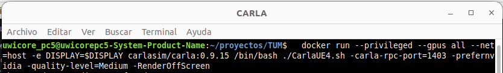
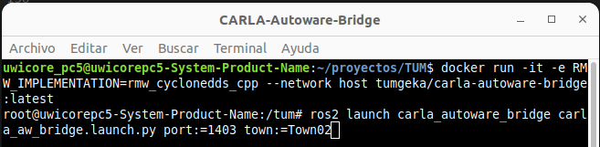
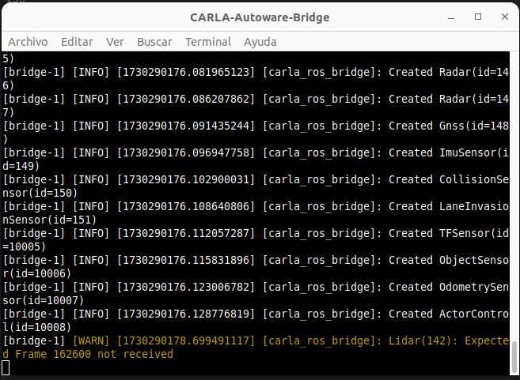
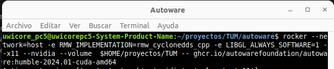
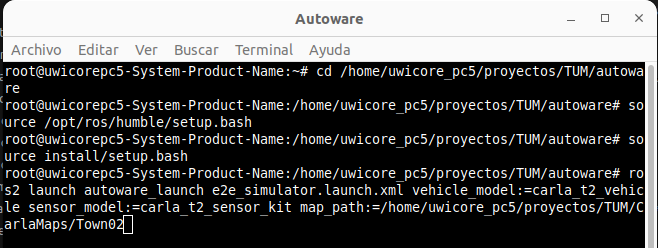
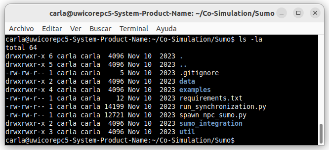

<div align="center">

# CARLA-Autoware Bridge

### Guía de instalación del entorno TUM

[Guía original](README_original.md) · [Guía de instalación](README.md) · [Guía rápida de uso](README_quick_start_guide.md)

</div>

Este documento pretende ser una guía de instalación del framework de simulación TUM que se ejecuta en torno al puente CARLA-Autoware.

El framework se compone de:
- **carla-autoware-bridge:** Este repositorio contiene CARLA-Autoware-Bridge.
- **ros-bridge:** Bifurcación del ros-bridge con cambios, aportados por el equipo de TUM, necesarios para CARLA-Autoware-Bridge.
- **carla-t2:** Paquetes de modelos de vehículos y kits de sensores del vehículo CARLA T2 2021 para Autoware.
- **carla-ros-msgs:** Bifurcación de carla-ros-msg con cambios, aportados por el equipo de TUM, necesarios para CARLA-Autoware-Bridge.

## Prerequisitos

- **Docker**
  [*Docker*](https://docker.com/) es un software de código abierto utilizado para desplegar aplicaciones dentro de contenedores virtuales.
  Para su instalación podemos seguir los pasos que se indican [**aqui**](https://docs.docker.com/engine/install/ubuntu/).

  ```bash
  # Install docker
  sudo apt install docker.io

  # Crea el grupo docker (si no existe) e añade tu usuario:
  sudo usermod -aG docker $USER

  # Aplica los cambios de grupo a la sesión actual:
  newgrp docker

  # Despues de añadir usuario al grupo de docker. Hay que reiniciar la session
  ```

- **NVIDIA Container Toolkit**
  [*NVIDIA Container Toolkit*](https://docs.nvidia.com/datacenter/cloud-native/container-toolkit/latest/index.html) permite a los usuarios crear y ejecutar contenedores acelerados por GPU. 
  Para su instalación podemos seguir los pasos que se indican [**aqui**](https://docs.nvidia.com/datacenter/cloud-native/container-toolkit/latest/install-guide.html).

  Reinicia los servicios de **Docker**.
  ```bash
    sudo systemctl restart docker
  ```
- **Rocker**
  [*Rocker*](https://github.com/osrf/rocker.git) una herramienta que facilita la ejecución de imágenes de Docker con características adicionales, como soporte de NVIDIA y X11 para aplicaciones gráficas.
  Para su instalacion seguiremos los siguientes pasos:
  - Es necesario tener instalado **Docker**.
  - Instalar **Go**. Rocker esta escrito en Go, por lo tanto necesitas tener instalado Go para poder compilarlo.
    - Descarga e instala Go desde el repositorio oficial.
    ```bash
        sudo apt update
        sudo apt install golang -y
    ```
    - Verifica la instalación
    ```bash
        go version
    ```
  - Instalar **Rocker**.

    - Clona el repositorio de Rocker desde GitHub:
      ```bash
        git clone https://github.com/osrf/rocker.git
      ```
    - Cambia al directorio de Rocker:
      ```bash
        cd rocker
      ```
    - Instalar dependencias de Python (si es necesario y existen)
      Es posible que el proyecto rocker tenga dependencias que se deben instalar antes de proceder. Si existe un archivo requirements.txt, puedes instalar las dependencias usando pip:
      ```bash
        pip3 install -r requirements.txt
      ```


    - Instalar Rocker usando setup.py
      Una vez que las dependencias estén instaladas, puedes instalar Rocker usando el archivo setup.py de la siguiente manera:

      ```bash
        pip install . --break-system-packages.py
      ```
      Esto instalará Rocker en tu sistema, y deberías poder acceder a él globalmente.
      
    - Verifica la instalación de Rocker
      Después de instalar, verificar que **rocker** esté disponible:
      ```bash
        rocker --version
      ```

## Instalación y uso


### CARLA

#### Descarga de Carla

Descargar carla del siguiente enlace:

https://carla.org/2023/11/10/release-0.9.15/

https://github.com/carla-simulator/carla/releases#release-0.9.15

Descomprimir en el directorio de trabajo: /home/uwicore_pc4/proyectos

Probar la ejecución
````bash
cd ~/proyectos/CARLA_0.9.15/
./CarlaUE4.sh -carla-rpc-port=1403 -prefernvidia -quality-level=Medium 
````
Si no se quiere entorno gráfico, añadir la opción -RenderOffScreen
````bash
./CarlaUE4.sh -carla-rpc-port=1403 -prefernvidia -quality-level=Medium -RenderOffScreen
````
Antes de ejecutar Carla se  recomienda ejecutar los siguiente comandos para mejorar el rendimiento de la tarjeta de red

````bash
sudo sysctl -w net.core.rmem_max=2147483647
sudo sysctl -w net.core.wmem_max=2147483647
sudo sysctl -w net.ipv4.ipfrag_time=3
sudo sysctl -w net.ipv4.ipfrag_high_thresh=134217728
````

Nota: Si se quiere usar docker, seguir los siguientes pasos:

  #### Descarga del docker
  En primer lugar descargaremos la imagen del contenedor de CARLA, TUM recomienda la version 0.9.15.
  ```bash
  docker pull carlasim/carla:0.9.15
  ```

  #### Ejecución
  Una vez descargada la imagen lanzaremos una ejecución del contenedor de CARLA.
  bash
  ```
    docker run --name "carla_docker" --privileged --gpus all --net=host -e DISPLAY=$DISPLAY carlasim/carla:0.9.15 /bin/bash ./CarlaUE4.sh -carla-rpc-port=1403 -prefernvidia -quality-level=Medium -RenderOffScreen
  ```
  <center>

  

  </center>
  Este comando lanzará un contenedor Docker en el cual se estará ejecutando CARLA, admitiendo peticiones a través de su API por el puerto 1403, este puerto se puede cambiar por otro si se desea. Añadimos el parámetro ***-prefernvidia*** para utilizar la GPU NVIDIA para la aceleración de hardware. El parametro ***-quality-level*** nos va a permitir ajustar el nivel de calidad para adecuar el consumo de memoria de video. Con el parametro ***-RenderOffScreen*** desactivamos la visualización. 

### CARLA-Autoware-Bridge

#### Descarga y creación del docker
Se puede descargar la imagen de docker ~~docker pull tumgeka/carla-autoware-bridge:latest~~. 

Se opta por hacer un fork al repositorio de [*Uwicore*](https://github.com/uwicore/Carla-Autoware-Bridge). De esta forma se tiene una copia del repositorio de [*TUM*](https://github.com/TUMFTM/Carla-Autoware-Bridge)

Creamos una carpeta de trabajo, por ejemplo proyectos/TUM

Se clona el repositorio desde el repositorio de Uwicore:
```bash
git clone git@github.com:uwicore/Carla-Autoware-Bridge.git      
```
~~Antes: git clone https://github.com/TUMFTM/Carla-Autoware-Bridge.git  .~~


Construimos la imagen docker ejecutando build_docker.sh
```bash
cd Carla-Autoware-Bridge/docker/
./build_docker.sh
```
#### Mapas
 Autoware necesita los mapas en un formato especial "lanelet2".
 Están disponibles [*aquí*](https://syncandshare.lrz.de/getlink/fiBgYSNkmsmRB28meoX3gZ/).

 Parece que ese directorio ya no existe, hay que coger los mapas que están en el PC-5 o PC-6.
 Si los mapas tienen un repositorio. Hay dos ramas, los mapas de Hatem y los mapas de TUM, con las pruebas de relevance

 Se crea un directorio y se descomprimen los mapas en:
 ```
 ~/proyectos/TUM/CarlaMaps
 ```
#### Ejecución
Teniendo el contenedor de  ***CARLA*** en ejecución lanzaremos el puente ***CARLA-Autoware-Bridge***.
Ejecutamos el docker del contenedor que va a manejar el puente.
```bash
docker run -it --name 'carlaBridge_docker' -e ROS_DOMAIN_ID=4 -e RMW_IMPLEMENTATION=rmw_cyclonedds_cpp --network host tumgeka/carla-autoware-bridge:latest
```
Lanzamos el puente ejecutando la instrucción de ros pertinente.
```bash
ros2 launch carla_autoware_bridge carla_aw_bridge.launch.py port:=1403 town:=Town01
```
<center>



</center>

En esta instruccion estamos indicando que use carla_autoware_bridge atacando al puerto 1403, que es por el que CARLA se comunica. Con el argumento ***town*** especificamos el mapa que se va a utilizar para la simulación.

Sabremos que el puente ya está listo cuando se hayan creado todos los objetos (el ultimo es el que tiene id=10008). Quedará algo como la imagen que se muestra a continuación.
<center>



</center>


<small>
*Nota: Cada vez que cambiemos configuración de los sensores habrá que reconstruir la imagen docker del puente yendo al directorio Carla-Autoware-Bridge de nuestra máquina y ejecutando la instrución ***./docker/build_docker.sh***.
</small>


### Autoware
#### Descarga del docker
En primer lugar descargaremos la imagen del contenedor de Autoware, TUM recomienda la version 2024.01. Esta operación tarda 6-8 horas...
```bash
docker pull ghcr.io/autowarefoundation/autoware:humble-2024.01-cuda-amd64
```
#### Descarga del repositorio
En paralelo, mientra se descarga el docker: se hace un fork al repositorio de [*Uwicore*](https://github.com/uwicore/Carla-Autoware-Bridge). De esta forma se tiene una copia del repositorio de [*Autoware*](https://github.com/autowarefoundation/autoware/)

Se clona el repositorio desde el repositorio de Uwicore:
```bash
git clone git@github.com:uwicore/autoware.git      
```
~~Antes: git clone https://github.com/autowarefoundation/autoware.git  .~~

Autoware cambia con frecuencia, la guia TUM recomienda utilizar una version etiquetada como "**https://github.com/uwicore/autoware/tree/2024.01**".

Se puede ir a la etiqueta **2024.01** o a la rama **release/2024.01**

```bash
cd autoware
git checkout release/2024.01
```
#### Descargar repositorios adicionales y vehiculos

Siguiendo la guia de [*Autoware*](https://autowarefoundation.github.io/autoware-documentation/main/how-to-guides/integrating-autoware/creating-your-autoware-repositories/creating-autoware-repositories/):

En el direcctorio ***/home/uwicore_pc4/proyectos/TUM/autoware*** se encuentra el fichero autoware.repos que contiene un listado de repositorios especificos que necesita autoware para su ejecución. Creamos una carpeta "***src***" y clonaremos estos repositorios mediante la opción import del comando vcs. Está operación tarda casi 1 hora...

```bash
cd /home/uwicore_pc4/proyectos/TUM/autoware
mkdir -p src
vcs import src < autoware.repos
```
A continuación entramos en la carpeta src y clonamos el repositorio donde TUM tiene su kit de sensores y el modelo del vehículo.

Se hace un fork al repositorio de [*Uwicore*](https://github.com/uwicore/Carla_t2). De esta forma se tiene una copia del repositorio de [*Carla_t2*](https://github.com/TUMFTM/Carla_t2/)

Se clona el repositorio desde el repositorio de Uwicore:
```bash
cd src
git clone git@github.com:uwicore/Carla_t2.git      
```
~~Antes: git clone https://github.com/TUMFTM/Carla_t2.git  .~~

```bash
~~cd src~~
~~git clone https://github.com/TUMFTM/Carla_t2.git~~
```

#### Ejecución del docker
Teniendo el contenedor de  ***CARLA*** y ***CARLA-Autoware-Bridge*** en ejecución se lanza ***Autoware***.

Se hace uso de ***Rocker*** para ejecutar el contenedor de ***autoware***.
```bash
rocker --network=host -e RMW_IMPLEMENTATION=rmw_cyclonedds_cpp -e LIBGL_ALWAYS_SOFTWARE=1 --x11 --nvidia --volume  $HOME/proyectos/TUM -- ghcr.io/autowarefoundation/autoware:humble-2024.01-cuda-amd64
```

<center>



</center>

El contenedor hace uso de un volumen, es una "carpeta compartida" entre el contenedor y la máquina anfitriona.


#### Corrección del error de clave GPG de ROS 2

Al ejecutar ***Rocker*** con la imagen de Autoware puede aparecer el siguiente error durante la construcción de la imagen intermedia:

```text
EXPKEYSIG F42ED6FBAB17C654 Open Robotics <info@osrfoundation.org>
E: The repository 'http://packages.ros.org/ros2/ubuntu jammy InRelease' is not signed.
```

Este error se produce porque la imagen original de Autoware contiene una clave GPG de ROS 2 caducada. Cuando Rocker construye su imagen intermedia y ejecuta `apt-get update`, la validación del repositorio de ROS 2 falla.

Para solucionarlo crearemos una imagen derivada de Autoware con la clave actualizada.

Creamos un directorio para almacenar el fichero ***Dockerfile***:

```bash
mkdir -p $HOME/proyectos/TUM/autoware-fixed
cd $HOME/proyectos/TUM/autoware-fixed
nano Dockerfile
```

Introducimos el siguiente contenido en el fichero ***Dockerfile***:

```dockerfile
FROM ghcr.io/autowarefoundation/autoware:humble-2024.01-cuda-amd64

USER root

# Desactivar temporalmente el repositorio de ROS 2 porque su clave está caducada.
RUN mv /etc/apt/sources.list.d/ros2.list \
       /etc/apt/sources.list.d/ros2.list.disabled || true

# Instalar las herramientas necesarias para actualizar la clave.
RUN apt-get update && \
    apt-get install -y --no-install-recommends \
        curl \
        gnupg \
        lsb-release \
        ca-certificates && \
    rm -rf /var/lib/apt/lists/*

# Descargar e instalar la clave actualizada del repositorio de ROS 2.
RUN curl -sSL \
        https://raw.githubusercontent.com/ros/rosdistro/master/ros.key \
        -o /tmp/ros.key && \
    gpg --batch --yes --dearmor \
        -o /usr/share/keyrings/ros-archive-keyring.gpg \
        /tmp/ros.key && \
    rm -f /tmp/ros.key

# Reactivar el repositorio de ROS 2 y comprobar que apt funciona correctamente.
RUN mv /etc/apt/sources.list.d/ros2.list.disabled \
       /etc/apt/sources.list.d/ros2.list || true && \
    apt-get update && \
    apt-get install -y --no-install-recommends \
        libglvnd0 \
        libgl1 \
        libglx0 \
        libegl1 \
        libgles2 && \
    rm -rf /var/lib/apt/lists/*
```

Guardamos el fichero y construimos la nueva imagen:

```bash
docker build -t autoware-fixed .
```

Una vez construida, ejecutaremos ***Rocker*** utilizando la imagen `autoware-fixed` en lugar de la imagen original de Autoware:

```bash
rocker \
  --network=host \
  -e RMW_IMPLEMENTATION=rmw_cyclonedds_cpp \
  -e LIBGL_ALWAYS_SOFTWARE=1 \
  -e ROS_DOMAIN_ID=4 \
  --x11 \
  --nvidia \
  --volume /home/uwicore_pc4/proyectos/TUM/ \
  --name 'autoware_docker' \
  -- autoware-fixed
```

Es importante que al final del comando aparezca:

```bash
-- autoware-fixed
```

y no la imagen original:

```bash
-- ghcr.io/autowarefoundation/autoware:humble-2024.01-cuda-amd64
```

La imagen `autoware-fixed` mantiene el contenido de la imagen original de Autoware, pero incorpora la clave actualizada del repositorio de ROS 2, permitiendo que Rocker construya correctamente su imagen intermedia.


#### Configuración de NVIDIA para Docker

Para ejecutar Autoware mediante ***Rocker*** con acceso a la tarjeta gráfica NVIDIA, Docker debe tener instalado y configurado correctamente el ***NVIDIA Container Toolkit***.

Si esta configuración no está realizada, al lanzar Rocker puede aparecer el siguiente error:

```text
docker: Error response from daemon: could not select device driver "" with capabilities: [[gpu]]
```

Este error indica que Docker no puede proporcionar acceso a la GPU NVIDIA al contenedor.

Los siguientes comandos deben ejecutarse en la máquina anfitriona, fuera del contenedor de Autoware.

##### Comprobar el controlador NVIDIA

En primer lugar, comprobamos que el controlador NVIDIA está instalado y funcionando correctamente:

```bash
nvidia-smi
```

El comando debe mostrar información sobre la tarjeta gráfica, la versión del controlador y la versión de CUDA soportada.

Si el comando no existe o muestra un error, será necesario instalar o reparar primero el controlador NVIDIA del sistema.

##### Comprobar NVIDIA Container Toolkit

Comprobamos si el ***NVIDIA Container Toolkit*** está instalado:

```bash
nvidia-ctk --version
```

Si aparece el siguiente mensaje:

```text
nvidia-ctk: command not found
```

instalaremos el toolkit.

Primero instalamos las herramientas necesarias:

```bash
sudo apt-get update
sudo apt-get install -y ca-certificates curl gnupg2
```

Descargamos e instalamos la clave del repositorio de NVIDIA:

```bash
curl -fsSL https://nvidia.github.io/libnvidia-container/gpgkey \
  | sudo gpg --dearmor --yes \
  -o /usr/share/keyrings/nvidia-container-toolkit-keyring.gpg
```

Añadimos el repositorio oficial del NVIDIA Container Toolkit:

```bash
curl -s -L https://nvidia.github.io/libnvidia-container/stable/deb/nvidia-container-toolkit.list \
  | sed 's#deb https://#deb [signed-by=/usr/share/keyrings/nvidia-container-toolkit-keyring.gpg] https://#g' \
  | sudo tee /etc/apt/sources.list.d/nvidia-container-toolkit.list
```

Actualizamos la lista de paquetes e instalamos el toolkit:

```bash
sudo apt-get update
sudo apt-get install -y nvidia-container-toolkit
```

##### Configurar Docker para utilizar NVIDIA

Una vez instalado el toolkit, configuramos el runtime de NVIDIA para Docker:

```bash
sudo nvidia-ctk runtime configure --runtime=docker
```

Reiniciamos el servicio de Docker para aplicar los cambios:

```bash
sudo systemctl restart docker
```

Podemos comprobar que Docker reconoce el runtime de NVIDIA con el siguiente comando:

```bash
docker info | grep -i runtimes
```

Debería aparecer una salida similar a la siguiente:

```text
Runtimes: io.containerd.runc.v2 nvidia runc
```

##### Comprobar el acceso a la GPU desde Docker

Antes de volver a ejecutar Rocker, comprobamos que un contenedor Docker puede acceder correctamente a la GPU:

```bash
docker run --rm \
  --runtime=nvidia \
  --gpus all \
  nvidia/cuda:12.2.0-base-ubuntu22.04 \
  nvidia-smi
```

El comando debe mostrar dentro del contenedor la información de la tarjeta gráfica NVIDIA.

Si la prueba funciona correctamente, ya podremos ejecutar Rocker con soporte para GPU:

```bash
rocker \
  --network=host \
  -e RMW_IMPLEMENTATION=rmw_cyclonedds_cpp \
  -e LIBGL_ALWAYS_SOFTWARE=1 \
  -e ROS_DOMAIN_ID=4 \
  --x11 \
  --nvidia \
  --volume /home/uwicore_pc4/proyectos/TUM/ \
  --name autoware_docker \
  -- autoware-fixed
```

La opción:

```bash
--nvidia
```

hace que Rocker ejecute internamente Docker utilizando la opción:

```bash
--gpus all
```

Por tanto, el NVIDIA Container Toolkit debe estar instalado y configurado antes de lanzar el contenedor de Autoware.

#### Compilación

Dentro del docker se tienen todas las herramientas para compilar,En el directorio autoware -> compilamos. Esta operación tarda un poco (casi 1 hora), no desesperes, es normal :D.
```bash
cd /home/uwicore_pc4/proyectos/TUM/autoware
source /opt/ros/humble/setup.bash
colcon build --symlink-install --cmake-args -DCMAKE_BUILD_TYPE=Release
```


Para ejecutar autoware con CARLA y con CARLA-Autoware-Bridge necesitaremos realizar algunos ajustes que se especifican en la siguiente url y detallamos a continuación.

[Cambios necesarios en Autoware](doc/autoware-changes.md).

Primero tenemos que cambiar la ruta del directorio de configuracion del modelo del sensor. Para esto nos vamos al fichero ***autoware.launch.xml***  que se encuentra en la ruta ***../autoware/src/launcher/autoware_launch/autoware_launch/launch/autoware.launch.xml*** y buscamos el atributo ***config_dir***.

Cambiamos la linea

```xml
<arg name="config_dir" value="$(find-pkg-share individual_params)/config/$(var vehicle_id)/$(var sensor_model)"/>
```
por
```xml
<arg name="config_dir" value="$(find-pkg-share carla_t2_sensor_kit_description)/config/"/>
```

También es necesario cambiar el tema de entrada de LiDAR y el contenedor de LiDAR. Para esto nos vamos al fichero ***tier4_localization_component.launch.xml*** que se encuentra en la ruta ***autoware/src/launcher/autoware_launch/autoware_launch/launch/components/tier4_localization_component.launch.xml*** y buscamos el atributo ***input_pointcloud***.

Cambiamos la linea
```xml
  <arg name="input_pointcloud" default="/sensing/lidar/top/pointcloud" description="The topic will be used in the localization util module"/>
```
por 
```xml
  # input_pointcloud
  <arg name="input_pointcloud" default="/sensor/lidar/front" description="The topic will be used in the localization util module"/>
  # container name
  <arg
      name="lidar_container_name"
      default="/sensing/lidar/front/pointcloud_preprocessor/pointcloud_container"
      description="The target container to which lidar preprocessing nodes in localization be attached"
  />
```
Al haber realizado cambios en los ficheros de configuración, es necesario recompilar, pero esta vez especificamos que solo lo haga con el packete autoware_launch.
```bash
colcon build --packages-select autoware_launch
```

A continuacion, ejecutaremos un par de scripts con el comando ***source*** que serviran para, entre otras cosas, establecer algunas variables de entorno necesarias.

```bash
source /opt/ros/humble/setup.bash
source install/setup.bash
```
Por ultimo, lanzaremos ***autoware*** mediante un comando de ***ros***, indicando el tipo de vehiculo, el kit de sensores y el path donde se ubica el mapa que queremos utilizar y que se indicó también al lanzar el puente.
```bash
ros2 launch autoware_launch e2e_simulator.launch.xml vehicle_model:=carla_t2_vehicle sensor_model:=carla_t2_sensor_kit map_path:=/home/uwicore_pc4/proyectos/TUM/CarlaMaps/Town01
```

<center>



</center>

### Integración con SUMO

En primer lugar, es necesario instalar SUMO para ejecutar la cosimulación.
En este [enlace](https://sumo.dlr.de/docs/Installing/) podremos obtener mas información acerca de como instlar SUMO desde el una distribución.
En la pagina oficial de sumo encontramos diferentes vías para su instalación, se recomienda compilar desde el código fuente ya que existe nuevas funciones y correcciones que mejorarán la cosimulación.
En este [enlace](https://sumo.dlr.de/docs/Installing/Linux_Build.html) podremos obtener mas información acerca de como compilar sumo desde las fuentes.

#### Ficheros de Co-Simulación

Si Carla está instalado, los archivos están en:
```bash
/home/uwicore_pc4/proyectos/CARLA_0.9.15/Co-Simulation/Sumo
```

Si Carla está en un Docker, en otro terminal abrir un terminal bash del docker de carla:

```bash
docker exec -i -t carla_docker /bin/bash
cd Co-Simulation/Sumo
pwd
/home/carla/Co-Simulation/Sumo
```
Si no se está ejecuatando carla en docker, los ficheros están en la ruta de instalación de CARLA


<center>



</center>

Salimos del docker y copiamos los ficheros a la carpera TUM bridge que se está empleando:

```bash
exit 
docker cp carla_docker:/home/carla/Co-Simulation/Sumo /home/uwicore_pc4/proyectos/TUM/Sumo
```


## Guía rápida de uso

Una vez completada la instalación y configuración de la plataforma, continúa con la [guía rápida de uso](README_quick_start_guide.md). En ella se indica el orden de arranque de CARLA, CARLA-Autoware-Bridge y Autoware, además del procedimiento actual para ejecutar y grabar simulaciones.

### Scripts de simulación

Los scripts utilizados para las simulaciones están versionados en el repositorio [Carla-Autoware-Scripts](https://github.com/uwicore/Carla-Autoware-Scripts).

Clona el repositorio dentro del directorio `TUM`:

```bash
cd /home/uwicore_pc4/proyectos/TUM
git clone git@github.com:uwicore/Carla-Autoware-Scripts.git
```

La clonación creará el directorio:

```text
/home/uwicore_pc4/proyectos/TUM/Carla-Autoware-Scripts
```

El repositorio contiene el flujo de simulación utilizado actualmente y conserva los scripts anteriores de Pablo en `scripts_pablo/`.
