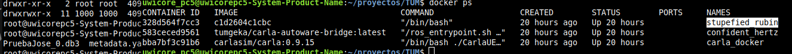
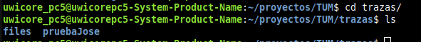

# Guía rápida de uso

A continuación se muestra una pequeña guía rápida de uso que asume que todas las configuraciones se han realizado correctamente y la plataforma esta lista para ser operativa.

### Abrir terminales

Yo uso terminales ***mate*** de linux que me permiten configurar diferentes perfiles. He configurado uno por cada componente de la plataforma para luego poder identificar a cual pertenece cada ventana de terminal por el titulo de la misma.

```bash
mate-terminal --window-with-profile=CARLA
mate-terminal --window-with-profile=CARLA-Autoware-Bridge
mate-terminal --window-with-profile=Autoware
```

### CARLA

Lanzaremos una ejecución del contenedor de CARLA.

```bash
  docker run --name "carla_docker" --privileged --gpus all --net=host -e DISPLAY=$DISPLAY carlasim/carla:0.9.15 /bin/bash ./CarlaUE4.sh -carla-rpc-port=1403 -prefernvidia -quality-level=Medium -RenderOffScreen
```
<center>


</center>

### CARLA-Autoware-Bridge

Ejecutamos el docker del contenedor que va a manejar el puente.
```bash
docker run -it \
  --name carlaBridge_docker \
  -e ROS_DOMAIN_ID=4 \
  -e RMW_IMPLEMENTATION=rmw_cyclonedds_cpp \
  --network host \
  tumgeka/carla-autoware-bridge:latest
```
Lanzamos el puente ejecutando la instrucción de ros pertinente.
```bash
ros2 launch carla_autoware_bridge carla_aw_bridge.launch.py port:=1403 town:=Town01
```
<center>


</center>

En esta instruccion estamos indicando que use carla_autoware_bridge atacando al puerto 1403, que es por el que CARLA se comunica. Con el argumento ***town*** especificamos el mapa que se va a utilizar para la simulación.

Sabremos que el puente ya está listo cuando se hayan creado todos los objetos (el ultimo es el que tiene id=10008). Quedará algo como la imagen que se muestra a continuación.
<center>


</center>

<a name="execAutoware"></a>
### Autoware

Hacemos uso de ***Rocker*** para ejecutar el contenedor de ***autoware***.
```bash
rocker \
  --network=host \
  -e RMW_IMPLEMENTATION=rmw_cyclonedds_cpp \
  -e LIBGL_ALWAYS_SOFTWARE=1 \
  -e ROS_DOMAIN_ID=4 \
  --x11 \
  --nvidia \
  --volume /home/uwicore_pc4/proyectos/TUM/ \
  --name autoware_docker \
  -- autoware-fixed
```
<center>


</center>

A continuacion, ejecutaremos un par de scripts con el comando ***source*** que serviran para, entre otras cosas, establecer algunas variables de entorno necesarias.

```bash
source /opt/ros/humble/setup.bash && source /home/uwicore_pc4/proyectos/TUM/autoware/install/setup.bash
```
Por ultimo, lanzaremos ***autoware*** mediante un comando de ***ros***, indicando el tipo de vehiculo, el kit de sensores y el path donde se ubica el mapa que queremos utilizar y que se indicó también al lanzar el puente.
```bash
ros2 launch autoware_launch e2e_simulator.launch.xml vehicle_model:=carla_t2_vehicle sensor_model:=carla_t2_sensor_kit map_path:=/home/uwicore_pc4/proyectos/TUM/CarlaMaps/Town01
```

<center>


</center>

## Simulación
### Grabación

Antes utilizabamos ***rosbag*** que es una herramienta de **ros** que sirve para monitorizar  topics y ahi seleccionabamos todos los topics que teniamos abiertos. Esto genera archivos demasiado pesados que llegan a colapsar el disco. Para solucionar estos problemas se desarrolló un modulo custum denominado ***raw_data_recorder***. De lo que se trata es de extraer los topics de los sensores, que son los que mas pesan, y grabarlos a parte con este nodo. No se graba el payload del mensaje entero, sino solo el tamaño que es lo que nos interesa, así se reduce el tamaño de los archivos generados de forma considerable.


El nuevo nodo custom ***raw_data_recorder*** está disponible en [https://github.com/uwicore/Carla-Autoware-_raw_data_recorder](https://github.com/uwicore/Carla-Autoware-_raw_data_recorder).

Copiamos la carpeta ***raw_data_recorder*** dentro del directorio src de autoware, en mi caso ***$HOME/TUM/proyectos/autoware/src***.

Necesitaremos realizar unos pequeños cambios en la configuración del nodo. Para ello abrimos el fichero ***raw_data_recorder_node.py***, en mi caso se encuentra en ***/home/uwicore_pc4/proyectos/TUM/autoware/src/raw_data_recorder/raw_data_recorder/raw_data_recorder_node.py***.
- Buscamos ***self.sensor_file_path***. En esa propiedad se especifica el path del fichero de configuración de los sensores, en mi caso esa linea queda de la siguiente manera:

```python
self.sensor_file_path = '/home/uwicore_pc4/proyectos/TUM/Carla-Autoware-Bridge/config/objects.json'
```
- Buscamos la definición de la variable save_csv que especifican la ruta y el fichero donde se guardaran los resultados, en mi caso esa linea queda de la siguiente manera:
  
```python
def save_csv(self, path='/home/uwicore_pc4/proyectos/TUM/AutowareTrace_0_Sensors.csv'):
```

Recompilar para que este modulo esté disponible.

```
cd /home/uwicore_pc4/proyectos/TUM/autoware
source /opt/ros/humble/setup.bash
source install/setup.bash
colcon build --packages-select raw_data_recorder
```

En este momento podremos [ejecutar autoware](#execAutoware) 

Para realizar la grabación tendremos que abrir otro terminal y entramos dentro del contenedor de autoware. Con el comando ***docker ps*** podremos ver los contenedores que hay en ejecución para saber que nombre se ha asignado al contenedor que tiene autoware en ejecución.

<center>



</center>

Una vez sabemos el nombre del contenedor podremos entrar con el comando:
```
docker exec -it <nombre_contenedor> bash
```

A continuación prepararemos el comando de grabación de datos en un "bag" indicando los tópics y parámetros necesarios para registrar datos en un entorno de simulación (No ejecutar aún, tenemos que preparar otros comandos en otras terminales).

```
cd /home/uwicore_pc4/proyectos/TUM/autoware
source install/setup.bash
ros2 bag record /clock /localization/kinematic_state /localization/acceleration /map/vector_map /sensing/gnss/ublox/nav_sat_fix /sensing/imu/tamagawa/imu_raw /sensing/gnss/pose_with_covariance /sensing/imu/imu_data /sensing/radar/front_center/objects /sensing/radar/front_left/objects /sensing/radar/front_right/objects /sensing/radar/rear_left/objects /sensing/radar/rear_right/objects /perception/object_recognition/detection/rois0 /perception/object_recognition/detection/rois1 /perception/object_recognition/detection/rois2 /perception/object_recognition/detection/rois3 /perception/object_recognition/detection/rois4 /perception/object_recognition/detection/centerpoint/ validation/objects /perception/object_recognition/detection/objects /perception/object_recognition/objects /perception/occupancy_grid_map/map /perception/obstacle_segmentation/pointcloud /planning/scenario_planning/max_velocity_candidates /planning/scenario_planning/status/stop_reasons /planning/scenario_planning/lane_driving/trajectory /planning/scenario_planning/trajectory /control/trajectory_follower/control_cmd /control/command/control_cmd /control/command/emergency_cmd /control/command/hazard_lights_cmd /control/command/turn_indicators_cmd/vehicle/status/hazard_lights_status /vehicle/status/steering_status /vehicle/status/turn_indicators_status /vehicle/status/velocity_status -o <bag_name> --qos-profile-overrides-path qos_override.yaml
```
Sustituir **<bag_name>** por el nombre de la grabación, de acuerdo a lo establecido en **SimulationGuide**.

En otra terminal lanzaremos el nodo encargado de procesar la información de los sensores, reduciendo el peso de la traza final (No ejecutar aún, tenemos que preparar otros comandos en otras terminales).

```
cd /home/uwicore_pc4/proyectos/TUM/autoware
source install/setup.bash
ros2 run raw_data_recorder raw_data_recorder_node
```

Una vez el escenario este corriendo podemos ejecutar los comandos que hemos preparado en los terminales anteriores y comenzará la grabación. Al terminar la prueba tendremos por un lado la carpeta que hemos especificado en **<bag_name>** y el fichero de resultados que genera el nodo **raw_data_recorder** en formato csv, se guarda en la ruta que especificamos en el fichero de configuración **raw_data_recorder_node.py**.

### Post Procesado
En el cluster disponemos de una serie de scripts que pasaremos a describir a continuación y que sirven para organizar los ficheros resultantes de la prueba. Los scripts se encuentran comprimidos en el archivo ***files.tar.gz*** en la ruta: 
```bash
/media/home/otros/proyectos/plataformaCAM
```
En mi caso he creado un directorio dentro  ***/home/uwicore_pc4/proyectos/TUM*** llamado ***trazas***, donde he descomprimido el archivo anterior y guardaré las trazas que vaya generando.

Lo primero que tenemos que hacer es mover la carpeta de nuestra grabación, que estará dentro del directorio autoware, dentro del directorio ***trazas***. En mi caso, si ya estoy dentro del direcctorio autoware, tendré que hacer:
```bash
sudo mv pruebaJose ../trazas
```

<center>



</center>

Ahora haremos uso del script Ros2bag2CSV.py, que lo que hace es convertir el fichero **.db3** resultante de la grabación a formato **csv** que es mas legible. Para ello hace uso del fichero ***converter_config.json***, que contiene las rutas de los topics de los mensajes que utilizamos y la ruta de la carpeta donde hemos hecho la grabación(Tendremos que adaptar estas rutas a nuestra máquina). Para ejecutarlo utilizaremos el interprete de python.

```bash
python3 Ros2bag2CSV.py
```

El siguiente script que utilizaremos se llama ***CSV_Merger.py***, que lo que hace es convinar los csv resultantes del proceso anterior ***AutowareTrace_0.csv*** y ***AutowareTrace_0_Sensors.csv*** en uno solo. Este script también se nutre del fichero ***converter_config.json*** para establecer rutas. El resultado final se guarda en ***AutowareTrace_0.csv***.

```bash
python3 CSV_Merger.py
```
Archivos adicionales que añadimos para aportar mas informacion a la traza:
- ***EgoTrajectory.png***
  Se trata de una captuira de pantalla del mapa de autoware donde se visualiza la trayectoría del ego vehicle.
- ***README.txt*** 
  Contiene información del escenario: nombre, mapa, descripción del mapa, información sobre sensores, etc. Para construirlo nos basamos en alguno existente en otro escenario.
- ***vehicle_trajectories***
  Contiene las trayectorias ploteadas de todos los vehiculos que hay en la traza de sumo. Se obtiene con el script ***SumoTajectoryExtractor.py***. Nos solicita el nombre de la carpeta de nuestro escenario y genera el fichero en formato png.

Posteriormente subimos a Drive los archivos que hemos ido generando. Seguir viendo video a partir del minuto 32 despues de ver el tema de sumo.
